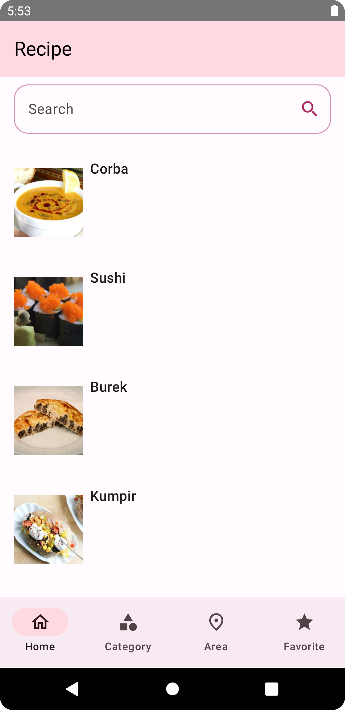

# Meal Recipe App

A Recipe App for Android, build with Native Kotlin & Jetpack Compose

# Screenshoot

    
    
    

    
    
    

# Tech Stack

- Kotlin
- Jetpack Compose
- Jetpack Compose Navigation
- Compose Destination
- Material Design 3
- Coroutine
- Kotlin Flows
- Paging 3
- Kotlinx Datetime
- Coil
- Hilt,
- Room
- Ktor Client
- MVVM
- Clean Architecture
- Modularization

Build Using Jetpack Compose, Clean Architecture, MVVM Architecture, Modularization Pattern, Hilt,
Room, Material Design 3, Paging 3, Ktor Client, Compose Destination