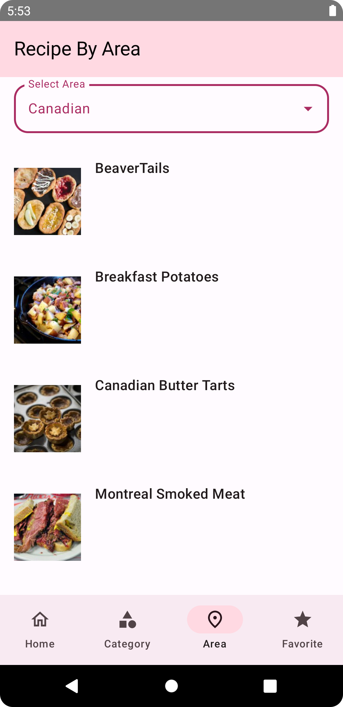

# Meal Recipe App

A Recipe App for Android, build with Native Kotlin & Jetpack Compose

# Feature
 - Home
 - Catalog Recipe By Category
 - Catalog Recipe By Area
 - Recipe Favorite
 - Detail of Recipe
 - Add Recipe To Favorite

# Screenshoot

    
    
    
    

    
    
    

# Tech Stack

- Kotlin
- Jetpack Compose
- Jetpack Compose Navigation
- Compose Destination
- Material Design 3
- Coroutine
- Kotlin Flows
- Paging 3
- Kotlinx Datetime
- Coil
- Hilt,
- Room
- Ktor Client
- MVVM
- Clean Architecture
- Modularization
